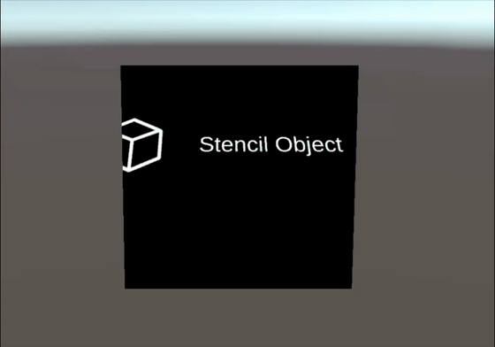

# PolySpatial Stencil Mask

Camera-projected polygon boundary masking on a reference plane, built with Shader Graph (URP, no stencil buffer, no custom HLSL).



## How it works

`StencilMask` (an invisible reference plane) and `StencilObject` (the surface you actually see) are two separate objects. A camera-ray trick is what lets them live in different places and still mask correctly:


**A · Setup** — the rendered surface and the reference plane are two separate objects, free to sit anywhere in the scene.

**B · Ray cast** — the shader casts a ray from the camera through the fragment, `P`, and keeps going until it crosses `StencilMask`'s plane at `P′`.

**C · Boundary test** — `P′` is transformed into `StencilMask`'s local space and checked against the six boundary points (here, the shipped `CutOut` shape).

**D · Composite** — masking geometry (top) and texture content (bottom) are computed independently and only meet at the final multiply.

Because `P′` always lands on `StencilMask`'s real position, the cutout stays **visually anchored there as the camera moves** — even though `StencilObject`, and whatever it's displaying, can sit anywhere else in the scene entirely.

## Installation

**Package Manager (git URL)**
1. Window > Package Manager > `+` > Add package from git URL
2. Enter the URL of this repository

**Manual**
Copy this folder into your project's `Packages/` directory.

## Dependencies

Required for the package itself:
- `com.unity.render-pipelines.universal` 17.4.0
- `com.unity.shadergraph` 17.4.0
- `com.unity.ugui` 2.0.0

Required only for the Demo Scene's XR rig/interaction content (not used by `StencilView`/`StencilBoundary` themselves):
- `com.unity.inputsystem` 1.19.0
- `com.unity.xr.interaction.toolkit` 3.4.1
- `com.unity.xr.management` 4.5.4

## Demo Scene

Included with the package at `Samples/Demo/StencilMaskDemo.unity` — open it directly, no import step needed.

The demo uses an XR Interaction Toolkit rig (controllers, ray/poke interactors) to drive the `ChooseStencil` menu. To try it in the Editor without a physical headset, enable **XR Simulation** first:

1. Edit > Project Settings > XR Plug-in Management > enable the **Simulation** provider (under the Editor/Windows tab).
2. Enter Play mode — no further setup needed; the rig drives itself via the simulated provider.

## Setup

1. Create (or pick an existing) GameObject to act as the **reference plane** — its Transform's position/rotation/scale define where the boundary mask is evaluated. Add the `StencilView` component to it.
2. Create a **display surface** GameObject (any mesh, e.g. a Quad or Plane) with a `MeshRenderer`. Assign it a material using the `Shader Graphs/StencilMask` shader (a ready-made one ships at `Runtime/Materials/StencilMask.mat`).
3. On `StencilView`, fill in the inspector fields:

| Field | Purpose |
|---|---|
| `Stencil Projection Type > Static/Dynamic Stencil` | Content GameObjects toggled on/off by `ActivateStencil(GameObject)`. Both must be assigned (neither may be left empty) or `Start()` will throw. |
| `Dynamic Stencil Info > Counter Indicator / Counter` | An `Image` and `TMP_Text` driven by the built-in demo counter (optional to use — leave assigned to any UI elements, or ignore if you don't use the dynamic mode). |
| `Stencil Setup Info > Material Stencil` | The material (see step 2) that boundary/projection values get pushed into every time the active content changes. |
| `Stencil Setup Info > Stencil Mask` | The reference plane Transform (step 1's own Transform, or a separate one). |
| `Stencil Setup Info > Stencil Object` | The display surface Transform (step 2). Not read by the script itself — kept as a handle for your own use. |
| `Show Boundary Gizmo` / `Boundary Gizmo Color` | Editor-only Scene view preview of the active boundary polygon. |
| `Active Boundary` | A `StencilBoundary` asset (see below) — the six points that define the visible cutout shape. |

4. Assign a `StencilBoundary` asset to `Active Boundary`. An example (`CutOut`) ships in `Runtime/Boundaries/`.

## Authoring a boundary shape

Create one via **Assets > Create > Stencil > Boundary Definition**.

- `points` must contain **exactly 6** entries (the shader hardcodes `_Point0.._Point5`).
- Each point is in **meters**, as an offset from the reference plane's center:
  - `x` = meters along the reference plane's local **right** axis
  - `y` = meters along the reference plane's local **forward** axis
- Example — a 20cm × 50cm rectangle centered on the reference plane (needs 6 points; split one long edge in two to keep the count at 6):
  ```
  (-0.10, -0.25), (0, -0.25), (0.10, -0.25), (0.10, 0.25), (0, 0.25), (-0.10, 0.25)
  ```

## Runtime API (`StencilView`)

- `ActivateStencil(GameObject)` — hides both content GameObjects, activates the one passed in, and re-pushes shader values.

## Content

Feed your own render pipeline output into the `RenderTexture` assigned as the material's `MainTex` (`Runtime/Textures/StencilRenderTexture.renderTexture` by default) — this package only handles masking/display, not content generation.

## License

[MIT](LICENSE.md)
